# Databricks SQL API Demo

## Objetivo
Solução para realizar execução de consultas no Databricks SQL por meio API REST, conforme representado na imagem abaixo:

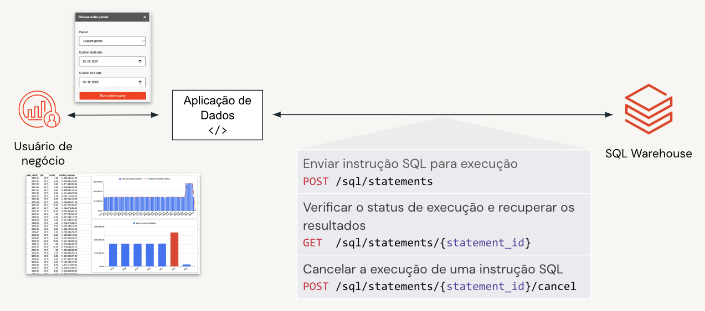

## Referências

Essa demonstração foi inspirada nesse repositório [DBSQL REST API](https://github.com/databricks-demos/dbsql-rest-api/tree/main), qque contém diversos exemplos de códigos que utilizam a API REST do DBSQL.

| Documentação                                                                                         | Link                                                                                                             |
|------------------------------------------------------------------------------------------------------|------------------------------------------------------------------------------------------------------------------|
| Statement Execution API                                                                              | https://docs.databricks.com/api/azure/workspace/statementexecution                                               |
| Run SQL statements on Databricks SQL warehouses with the Databricks SQL Statement Execution REST API | https://learn.microsoft.com/en-gb/azure/databricks/sql/admin/sql-execution-tutorial                              |
| Databricks SQL Statement Execution API – Announcing the Public Preview                               | https://www.databricks.com/blog/2023/03/07/databricks-sql-statement-execution-api-announcing-public-preview.html |
| Databricks SQL Statement Execution API – Announcing the Public Preview                               | https://learn.microsoft.com/en-gb/azure/databricks/sql/admin/sql-execution-tutorial |

## Execução da Demo

### Instalação do Postman

Para os testes que serão realizados na demonstração, utilizaremos o Postman. Caso você não tenha o Postman instalado, faça o download através do [link](https://www.postman.com/downloads/ ) abaixo e instale-o em seu computador.

### Importar a coleção

Dentro da pasta do `Postman`, temos dois arquivos JSON: `Databricks Environment.postman_environment.json` e `Databricks SQL Execution API.postman_collection.json`. O primeiro arquivo pode ser utilizado para definir variáveis de ambiente necessárias para estabelecer a conexão com o servidor Databricks, como `HOST`, `WAREHOUSE_ID` e `AUTH_TOKEN`. O último arquivo inclui várias solicitações de API usando fluxos síncronos e assíncronos.

Para usar a coleção Postman, siga os passos abaixo:

* Abra o Postman, vá para `My Workspace` e clique em `Import` para adicionar os dois arquivos.

### Configurar as credencias do Databricks

* Vá para `Environments` e selecione `Databricks Environment` para atualizar os parâmetros de conexão. Para encontrar as credencias do databricks para preencher o `Databricks Environment` no Postman, siga os passos abaixo:

    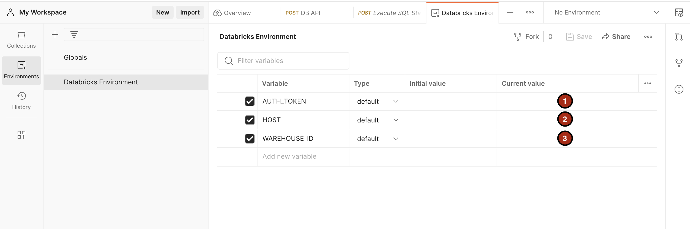
     
    #### **1.**  `AUTH_TOKEN`
    Existem diversas formas para se autenticar no Databricks, segue documentação com todas essas opções: [Autenticação para automação do Azure Databricks](https://learn.microsoft.com/pt-br/azure/databricks/dev-tools/auth). Nesse exemplo iremos criar o token através do token de acesso pessoal.

    * Acessar **User Settings**

        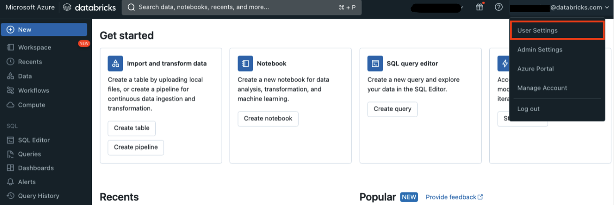

    * Em **Developer**, clique em **Manage** na categoria Access tokens.

        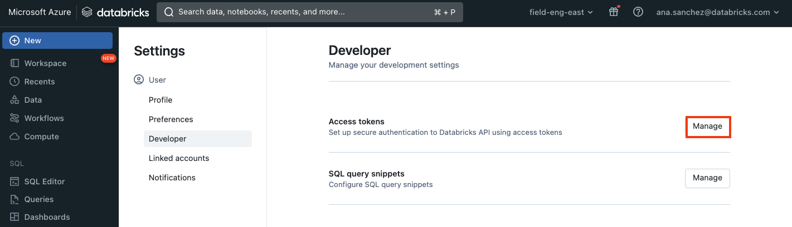

    * Clique em **Generate new token** para gerar seu token de acesso.

        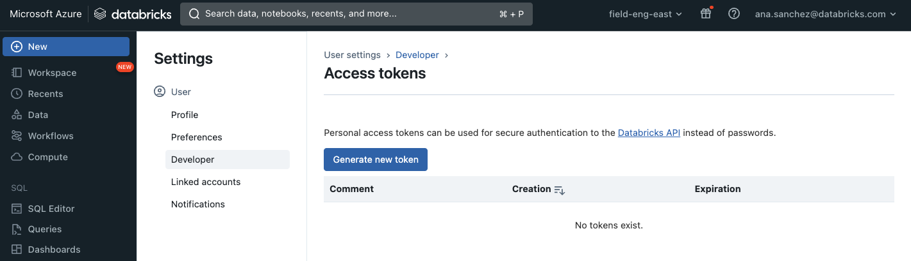

    * Coloque um comentário, selecione o tempo de vida do seu token (Lifetime) e clique em **Generate**.

        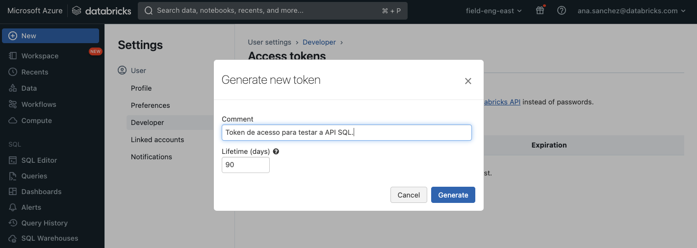

    * Copie o token e cole no campo **AUTH_TOKEN** do `Databricks Environment` no Postman.

    #### **2.**  `HOST`
    * Copie o host do seu workspace Databricks e cole no campo **HOST** do `Databricks Environment` no Postman.

        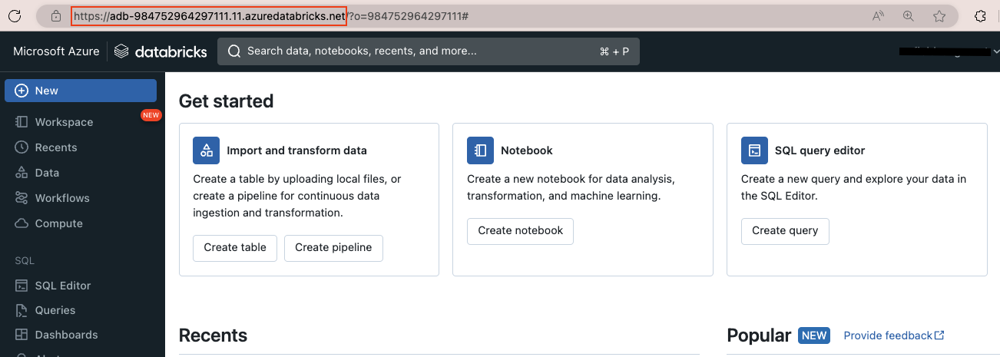

    #### **3.**  `WAREHOUSE_ID`
    * Em **SQL Warehouses** escolha o recurso que você utilizará para fazer as consultas, clique nele e copie o **ID**.

        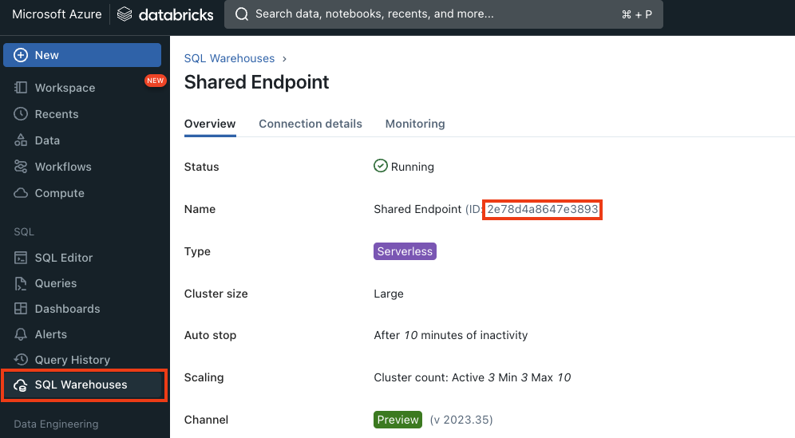

 

* Certifique-se de salvar as alterações e de selecionar `Databricks Enviroment` no seletor de ambiente. 
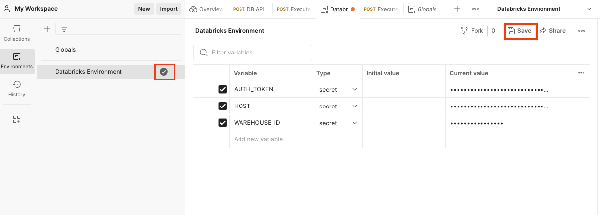

  

* Execute uma das solicitações de API para executar instruções.

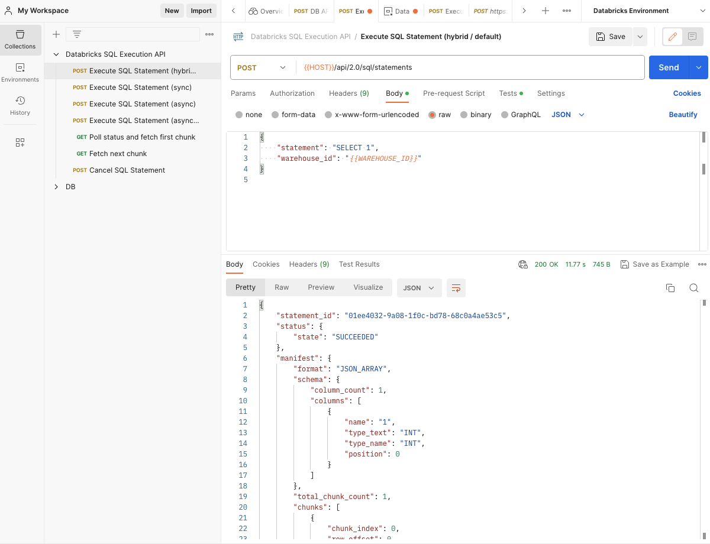

 

* Caso queira testar uma query sua, em **Body** edite o **statement** com sua query e execute.

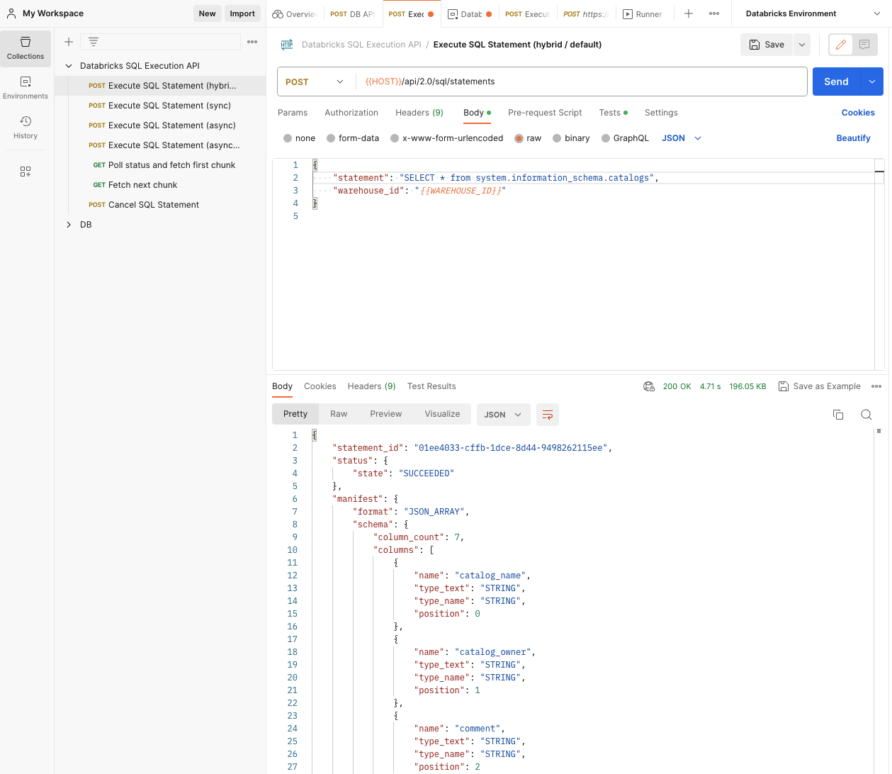
 

* Quando o payload for maior que 16 MB ele quebra o resultados em diferentes links para download, use as solicitações GET para consultar o status e buscar esses diferentes blocos.
 

* Para mais detalhes sobre as opções de parametrizações da API acesse as referências acima.
